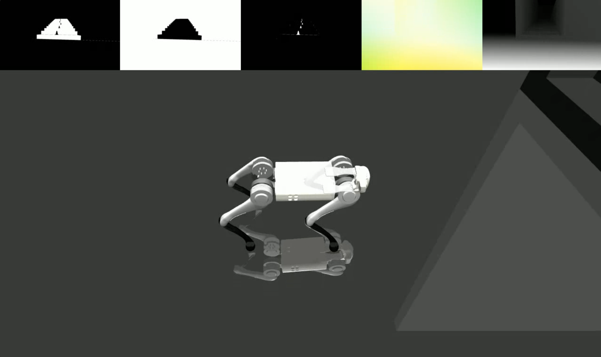
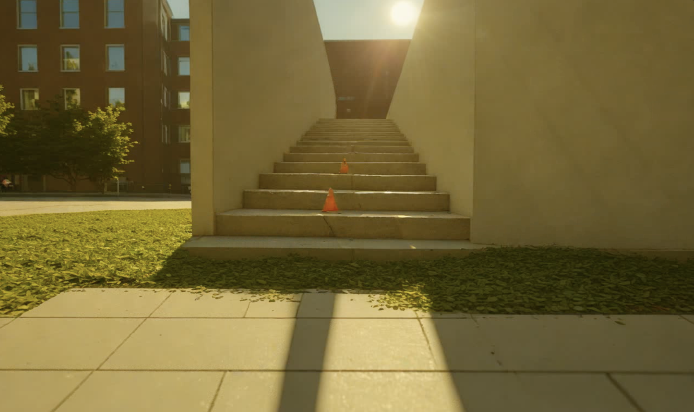

# LucidSim: Learning Visual Parkour from Generated Images

### [🌐 Project Website](https://lucidsim.github.io) | [📝 Paper](https://arxiv.org/abs/2411.00083) | [🎥 Video](https://www.youtube.com/watch?v=Xf-1zvt-4n8)

We bring realistic and diverse visual data from generative models to classical physics simulators, enabling robots to
learn highly dynamic tasks like parkour without requiring depth.

`lucidsim` contains our simulated environments built using MuJoCo. We provide the environments and tools for running the
LucidSim rendering pipeline for quadruped parkour. Training code is not yet included.

If you're looking for the generative augmentation
code (required for running the full rendering pipeline), please check out
the [weaver](https://github.com/lucidsim/weaver) repo!

**[Alan Yu](https://alany1.github.io)<sup>\*1</sup>, [Ge Yang](https://www.episodeyang.com/)<sup>\*1,2</sup>,
[Ran Choi](https://www.linkedin.com/in/ran-choi-tmr/)<sup>1</sup>,
[Yajvan Ravan](https://www.linkedin.com/in/yajvan-ravan/)<sup>1</sup>,
[John Leonard](https://meche.mit.edu/people/faculty/JLEONARD@MIT.EDU)<sup>1</sup>,
[Phillip Isola](https://people.csail.mit.edu/phillipi/)<sup>1</sup>**<br>
<sup>1 </sup>[MIT CSAIL](https://www.csail.mit.edu/),
<sup>2 </sup>[Institute of AI and Fundamental Interactions (IAIFI)](https://iaifi.org/)<br>
<sup>* </sup>Indicates equal contribution<br>
CoRL 2024

<table style="border-collapse: collapse; border: none; width: 100%;">
  <tr>
    <td style="text-align: center; border: none;">
      <br>
    </td>
    <td style="text-align: center; border: none;">
      <br>
    </td>
  </tr>
</table>


-----

**Table of Contents**

- [Installation](#installation)
    - [Setup Conda Environment](#1-setup-conda-environment)
    - [Install Dependencies](#2-install-dependencies)
    - [One Last Dependency](#3-installing-gym_dmc)
- [Usage](#usage)
    - [Basic LucidSim Pipeline](#rendering-conditioning-images)
    - [Full Rendering Pipeline (requires weaver)](#full-lucidsim-rendering-pipeline)
- [Citation](#citation)

### Installation

#### 1. Setup Conda Environment

If you followed the setup instructions from `weaver`, feel free to install on top of that environment.

```bash
conda create -n lucidsim python=3.10
conda activate lucidsim
```

#### 2. Install Dependencies

```bash
# Choose the CUDA version that your GPU supports. We will use CUDA 12.1
pip install torch==2.1.2 torchvision==0.16.2 torchaudio==2.1.2 --extra-index-url https://download.pytorch.org/whl/cu121

# Install lucidsim with more dependencies
git clone https://github.com/lucidsim/lucidsim
cd lucidsim
pip install -e .
```

#### 3..️ Installing gym_dmc

The last few dependencies require a downgraded `setuptools` and `wheel` to install. To install, please downgrade and
revert after.

```bash
pip install setuptools==65.5.0 wheel==0.38.4 pip==23
pip install gym==0.21.0
pip install gym-dmc==0.2.9
pip install -U setuptools wheel pip
```

## Usage

**Note:** On Linux, make sure to set the environment variable ` MUJOCO_GL=egl`.

LucidSim generates photorealistic images by using a generative model to augment the simulator's rendering, using
conditioning images to maintain control over the scene geometry.

#### Rendering Conditioning Images

We have provided an expert policy checkpoint under `checkpoints/expert.pt`. This policy was derived from that
of [Extreme Parkour](https://github.com/chengxuxin/extreme-parkour). You can use this policy to sample an environment
and visualize the conditioning images with:

```bash
# env-name: one of ['parkour', 'hurdle', 'gaps', 'stairs_v1', 'stairs_v2']
python play.py --save-path [--env-name] [--num-steps] [--seed]
````

where `save_path` is where to save the resulting video.

#### Full LucidSim Rendering Pipeline

To run the full generative augmentation pipeline, you will need to install the `weaver` package
from [here](https://github.com/lucidsim/weaver). When done, please also make sure the environment variables are still
set correctly:

```bash
COMFYUI_CONFIG_PATH=/path/to/extra_model_paths.yaml
PYTHONPATH=/path/to/ComfyUI:$PYTHONPATH
```

You can then run the full pipeline with:

```bash
python play_three_mask_workflow.py --save-path --prompt-collection [--env-name] [--num-steps] [--seed]
```

where `save_path` and `env_name` are the same as before. `prompt_collection` should be a path to a `.jsonl` file with
correctly formatted prompts, as in the `weaver/examples` folder.

We thank the authors of [Extreme Parkour](https://github.com/chengxuxin/extreme-parkour) for their open-source codebase,
which we used as a starting point for our expert policy (`lucidsim.model`).

## Citation

If you find our work useful, please consider citing:

```
@inproceedings{yu2024lucidsim,
  title={LucidSim: Learning Agile Visual Locomotion from Generated Images},
  author={Alan Yu and Ge Yang and Ran Choi and Yajvan Ravan and John Leonard and Phillip Isola},
  booktitle={8th Annual Conference on Robot Learning},
  year={2024},
}
```
